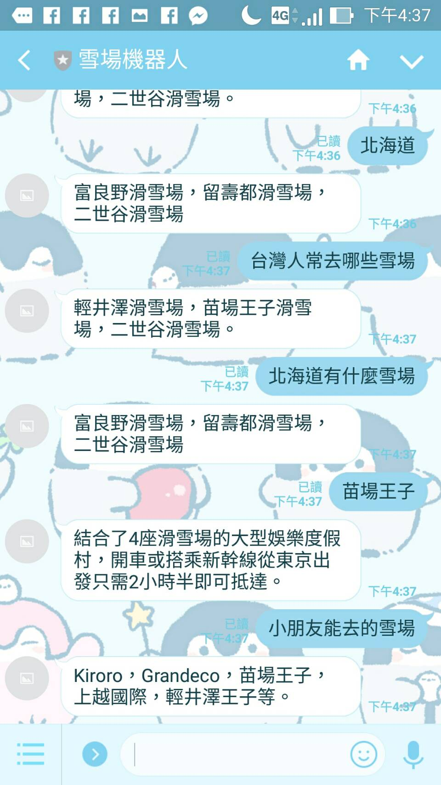
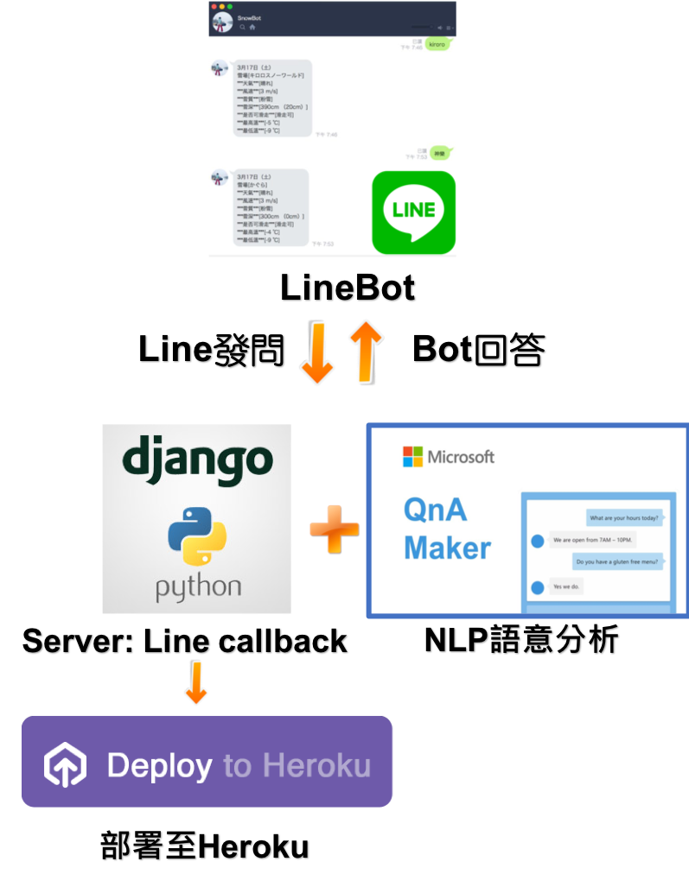

# 系統目標

我們希望開發一個LINE聊天機器人，能夠回答使用者的問題
在這個Scenario，我們假設這是一個日本雪場基本資料聊天機器人。
當使用者輸入雪場名字時，會回答有關日本各大雪場的基本資料。

# 系統規劃

# 前置技能

基礎Python能力（Linebot後端）

Command Line能力（Heroku部署，Run Django）

Git能力（Heroku部署）

# 需要使用到的工具
Microsoft Azure: QnAMaker：AI語意識別模組，透過輸入題庫及答案，丟進去給QnAMaker訓練，輸入類似問題時會自動比對出對應的答案。

Python + Django：搭配Python Line Bot API ，開發自動回應LINE訊息的後端服務Server。

Heroku + Git：部署我們的Linebot後端服務Server

Line Developer管理：須申請Line Developer帳號（或Line生活圈帳號）

# 相關教學文章

[01建造QnaMaker](https://medium.com/@hatsukiotowa/手把手教你搭建聊天機器人-linebot-python-qnamaker-heroku-01建造qnamaker-99b88e8993b4)

[02建造LineBot Backend Server 並部署至Heroku](https://medium.com/@hatsukiotowa/手把手教你搭建聊天機器人-linebot-python-qnamaker-heroku-02建造linebot-backend-server-並部署至heroku-59b36357cd9d)

[03串接QnAMaker Service](https://medium.com/@hatsukiotowa/手把手教你搭建聊天機器人-linebot-python-qnamaker-heroku-03串接qnamaker-service-beb892cd72ee)
